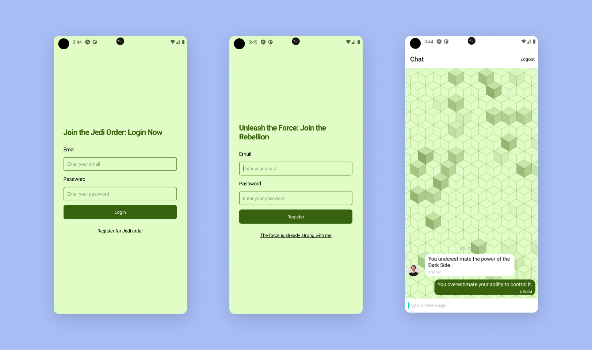

# React Native Gifted Chat Firebase Boilerplate with Expo


This is a boilerplate project for building a React Native chat application using the react-native-gifted-chat library and the Firebase backend. This project is built with Expo, a set of tools and services for building and deploying React Native apps.

## Screenshots



## Tech/Framework used

This boilerplate project uses the following tech/framework:

- React Native
- Expo
- React Navigation
- Firebase
- React Native Gifted Chat

## Getting Started

To get started with this boilerplate project, follow these steps:

1. **Clone the repository to your local machine:**

   ```console
   git clone https://github.com/Shahriar-Rumel/react-native-chat-app.git
   ```

2. **Install the required dependencies:**

   ```console
   npm install
   ```

3. **Setup Firebase:** Set up your Firebase project by following the instructions in the [Firebase documentation](https://firebase.google.com/docs/build) .

4. **Setup Environment Variables:** In the root directory of your project, create a new file called .env. Add your Firebase configuration values to the .env file in the following format:

   ```env
   API_KEY = <YOUR_API_KEY>
   AUTH_DOMAIN = <YOUR_AUTH_DOMAIN>
   PROJECT_ID = <YOUR_PROJECT_ID>
   STORAGE_BUCKET = <YOUR_STORAGE_BUCKET>
   MESSAGING_SENDER_ID = <YOUR_MESSAGING_SENDER_ID>
   APP_ID = <YOUR_APP_ID>
   ```

5. **Start the development server:**

   ```
   npm start
   ```

6. **Run the app on an emulator or device:**

   ```
   expo run android
   ```

   or

   ```
   expo run ios
   ```

## Features

This boilerplate project includes the following features:

- Integration with the Firebase backend for real-time messaging.
- User authentication with email and password using Firebase Authentication.
- A pre-configured GiftedChat component from the react-native-gifted-chat library for building a chat interface.
- Custom styling for the chat interface.
- A basic navigation structure with react-navigation.
- A sample ChatScreen component for displaying the chat interface and sending/receiving messages.

## Expo CLI

Expo CLI is a command-line interface tool that you can use to interact with your Expo projects. To install Expo CLI, run the following command:

```
npm install -g expo-cli
```

## License

This project is licensed under the MIT License
